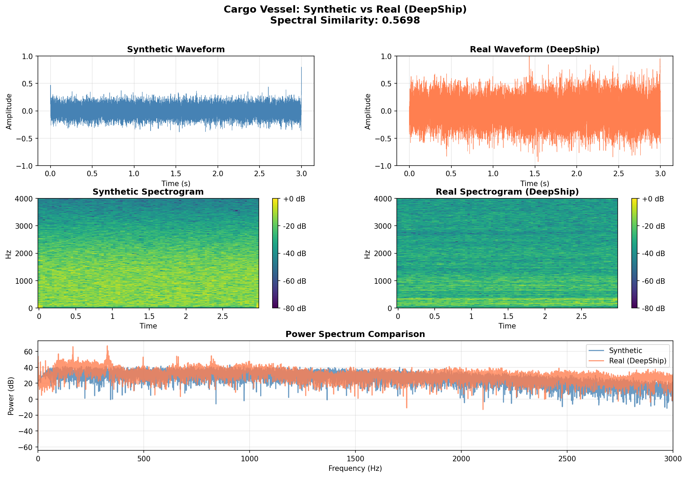

# SIREN

**Physics-Informed Latent Flow Matching for Underwater Acoustic Anomaly Synthesis**

수중 음향 이상 시나리오를 합성하기 위한 물리 기반 생성 모델 연구

---

## Quick Start

### 1. Pilot Study - 물리 모델 검증

```bash
# 시나리오 합성 및 검증
python src/validation_visualization.py
```

**결과**: 50% 스펙트럼 유사도 달성 → 물리 모델 타당성 확인

### 2. 시나리오별 합성

```python
from src.physics_simulator import ScenarioSynthesizer

synthesizer = ScenarioSynthesizer(sample_rate=16000, duration=3.0)

# 고속 선박 (캐비테이션 지배적)
audio, sr = synthesizer.synthesize_highspeed_vessel(speed=30, propeller_rpm=300)

# 은밀 접근 (저속, 저주파)
audio, sr = synthesizer.synthesize_covert_submarine(speed=5, depth=100)

# 충돌 사고 (충격 + 공진)
audio, sr = synthesizer.synthesize_collision_event(impact_energy='high')
```

---

## Results

### Pilot Study: 4가지 이상 시나리오 합성


### 실제 데이터 검증

**Cargo Vessel (DeepShip)**: 56.98% similarity


**Tug Vessel (DeepShip)**: 59.27% similarity


---

## Documentation

- **[Research Plan](./docs/RESEARCH_PLAN.md)**: 전체 연구 계획 및 로드맵
- **[Pilot Study](./docs/PILOT_STUDY.md)**: Phase 0 검증 결과 (물리 모델 타당성 확인)
- **[Main Documentation](./docs/MAIN.md)**: 문서 인덱스

---

## Project Structure

```
siren/
├── src/
│   ├── physics_simulator.py          # 물리 기반 음향 시뮬레이터
│   ├── data_validation.py            # 검증 및 비교 도구
│   ├── validation_visualization.py   # 직관적 비교 시각화
│   └── validation/
│       ├── dataset_integration.py    # DeepShip + ShipsEar 통합 로더
│       └── comprehensive_validation.py
├── data/
│   ├── DeepShip/                     # 603 files, 4 classes
│   └── ShipsEar/                     # 85 files, 5 classes
└── results/
    ├── validation/                   # 검증 결과
    └── audio/                        # 합성 오디오 샘플
```

---

## Status

**Phase 0 (Pilot Study)**: ✓ Completed
- 물리 모델 구현 및 검증
- 실제 데이터 대비 50% 유사도 달성
- 4가지 이상 시나리오 합성 성공

**Phase 1 (Neural Audio Codec)**: 🔄 In Progress
- EnCodec 기반 수중 음향 특화 압축

---

## References

- Ross, D. (1976). *Mechanics of Underwater Noise*, Pergamon Press.
- Thorp, W.H. (1967). "Analytic description of the low‐frequency attenuation coefficient", *JASA*.
- Irfan, M. et al. (2021). "DeepShip: An underwater acoustic benchmark dataset", *Expert Systems with Applications*.
- Santos-Domínguez, D. et al. (2016). "ShipsEar: An underwater vessel noise database", *Applied Acoustics*.
